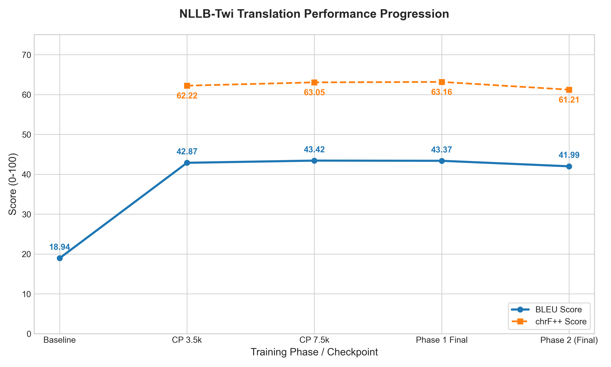
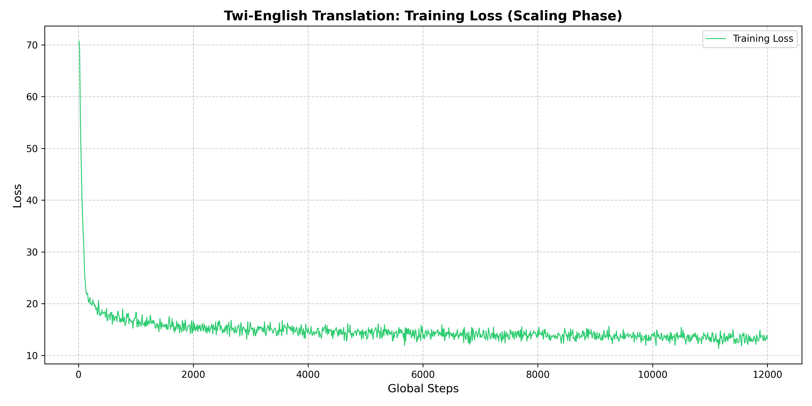
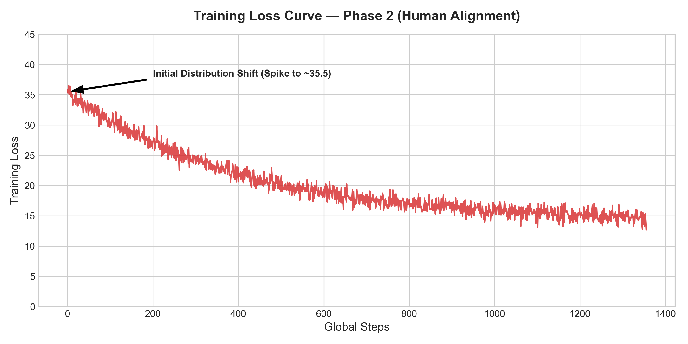
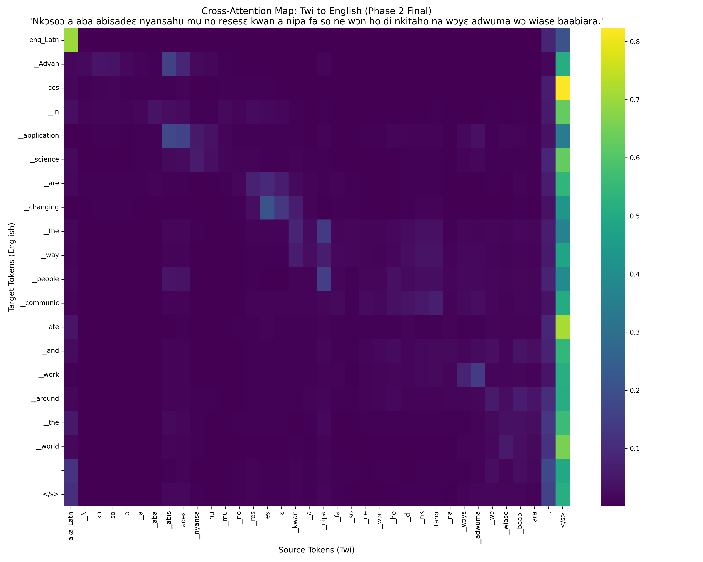

# A Two-Stage QLoRA Framework for High-Fidelity Twi-English Translation

This repository contains the full research pipeline for fine-tuning Meta's **NLLB-200 (600M parameter)** model on the Ghanaian language **Akan (Twi)**. The methodology is designed to operate under strict consumer-grade hardware constraints, specifically a 6GB VRAM ceiling, by combining 4-bit quantization with Parameter-Efficient Fine-Tuning (PEFT) via QLoRA. The project demonstrates that high-quality low-resource machine translation is achievable without access to large-scale GPU infrastructure.

## Results & Paradigm Comparison

To establish a comprehensive understanding of low-resource Twi-English translation, this project investigates two distinct training paradigms: **Single-Stage Direct Fine-Tuning** (developed in collaboration as a team) and **Two-Stage Curriculum Alignment** (developed to leverage massive synthetic scaling).

### Performance Summary Table

| Paradigm / Evaluation Point | Training Data | Evaluation / Test Set | BLEU | chrF / chrF++ | Split Status |
|---|---|---|---|---|---|
| **Baseline (Zero-Shot NLLB-200)** | — | Synthetic held-out (500 pairs) | 18.94 | — | N/A |
| **Phase 1: Synthetic Scaling** (Checkpoint 12,000) | 192,000 Synthetic | Synthetic held-out (500 pairs) | 43.37 | 63.16 | 100% Unseen |
| **Paradigm A: Single-Stage Direct Fine-Tuning** (Lanor & Nick Collab) | 3,888 Human | Human held-out (431 pairs) | **27.18** | **48.36** | **100% Unseen (Clean)** |
| **Paradigm B: Two-Stage Curriculum Alignment** (Final Human-Aligned) | 192k Synth + 4.3k Human | Synthetic held-out (500 pairs) | **41.99** | **61.21** | 100% Unseen (Clean) |

---

### Paradigm A: Single-Stage Direct Fine-Tuning
* **Model Repositories:** `Lanor-and-Nick/twi-english-nllb-lora` (Team) \| `mclanorjeff/twi-english-nllb-lora` (Author Copy)
* **Dataset Splitting:** Built using a rigorous, uncontaminated **90/10 split** of the human-verified dataset.
  * **Train Set:** 3,888 human sentences.
  * **Validation Set:** 431 human sentences (completely hidden from the model during training).
* **Key Results:** 
  * The model achieved its optimal performance at **Step 900**, reaching a highly competitive **27.18 BLEU** and **48.36 chrF** on unseen human-verified translations.
  * **Significance:** This is a remarkably high score for an extreme low-resource language pair, proving that a clean, direct fine-tune on high-quality human data can establish exceptionally natural conversational fluency.

### Paradigm B: Two-Stage Curriculum Alignment (Two-Stage QLoRA Framework)
* **Dataset Splitting:** Evaluated on a secret held-out slice of 500 synthetic sentences (from row 500,000+ of the GhanaNLP Pristine dataset) that were completely untouched by training.
* **Key Results:** 
  * Starting from a zero-shot baseline of 18.94 BLEU, Phase 1 synthetic scaling achieved a peak of **43.37 BLEU** (checkpoint 12,000) before human-alignment in Phase 2 stabilized it at **41.99 BLEU** (checkpoint 13,355).
  * **Significance:** By pre-training on 192,000 synthetic sentences, this model acquired massive vocabulary breadth and rigorous logical translation rules, making it highly robust to complex sentence structures.

---

### Key Research Insights: Single-Stage vs. Two-Stage
1. **The Generalization Profile:**
   * The **Single-Stage model** generalizes incredibly well to *natural human phrasing* (27.18 BLEU on human text), as it spent its entire training duration absorbing colloquial human expressions, idioms, and slang.
   * The **Two-Stage model** generalizes incredibly well to *complex sentence logic* (41.99 BLEU on synthetic text), as its synthetic pre-training provided it with an expansive grammatical framework that smaller datasets cannot replicate.
2. **The Training Efficiency:**
   * Single-stage training converged rapidly (optimal checkpoint at Step 900), showing that high-quality human translation is extremely sample-efficient.
   * Two-stage training required 13,355 cumulative steps but built a fundamentally more robust underlying translator capable of handling longer, more intricate sentences without syntactic breakdown.

**Evaluation Metrics Progression (Two-Stage Framework):**



### Conclusion
The final model represents a successful two-stage alignment: establishing high-precision translation logic through large-scale synthetic data (Phase 1), followed by refining the linguistic nuance through human-verified alignment (Phase 2). Achieving a BLEU score of **41.99** on a low-resource language like Twi, while operating under a **6GB VRAM hardware constraint**, demonstrates the viability of this methodology for accessible NLP research.

The transition from Phase 1 to Phase 2 resulted in a modest 1.38 BLEU point reduction on synthetic benchmarks—a documented phenomenon where the model trades "robotic" precision for natural, conversational fluency. This human-aligned adapter is the primary output of this research and is optimized for real-world translation tasks.

### Analysis of the Phase 1 Plateau (Steps 7,500–12,000)
As seen in the results table, the model achieved its peak synthetic performance at **Step 7,500 (43.42 BLEU)**. The final 4,500 steps of Phase 1 resulted in a negligible change (-0.05 BLEU), signaling a clear **Informational Plateau**. This plateau occurred because the model had fully internalized the syntactic regularities of the 192,000 synthetic sentences. Further training on this specific corpus would have likely led to overfitting on synthetic artifacts rather than genuine linguistic gains. This observation was the primary catalyst for transitioning to **Phase 2**, shifting the focus from data volume to data quality.

## Data Sources & Acknowledgements

This project would not have been possible without the foundational work of the **GhanaNLP community**.

**Phase 1: Synthetic Corpus**
The large-scale synthetic training data was sourced from the [GhanaNLP Pristine Twi-English Parallel Sentences](https://huggingface.co/datasets/ghananlpcommunity/pristine-twi-english-parallel-sentences) dataset, a corpus of approximately 15.6 million parallel sentence pairs generated via the Gemini API. We are grateful to the GhanaNLP team for making this resource publicly available and for their sustained contributions to African NLP infrastructure.

**Phase 2: Human-Curated Corpus**
The 4,331-sentence human-verified dataset (`data/train.csv`) used in the refinement phase was curated from the same GhanaNLP corpus and verified for correctness, naturalness, and cultural accuracy. This dataset is included in this repository for full reproducibility.

> GhanaNLP: https://ghananlp.org | Hugging Face: https://huggingface.co/ghananlpcommunity

## Live Deployment

The final human-aligned model and translation interface are live on Hugging Face:

- **Translator Space**: [NLLB-Twi-Translator](https://huggingface.co/spaces/mclanorjeff/NLLB-Twi-Translator)
- **Model Adapter**: [NLLB-Twi-Human-Aligned](https://huggingface.co/mclanorjeff/NLLB-Twi-Human-Aligned)

The adapter is approximately 15MB. At inference time, it merges automatically with Meta's frozen base model (`facebook/nllb-200-distilled-600M`, ~2.4GB).

## Hardware Environment

- **GPU:** NVIDIA RTX 2060 (6GB VRAM)
- **RAM:** 16GB System RAM
- **Storage:** Training outputs offloaded to a secondary drive to prevent OS drive saturation
- **Quantization:** 4-bit NormalFloat (NF4) via `bitsandbytes`
- **Effective Batch Size:** 16 (achieved via `per_device_train_batch_size=1` with `gradient_accumulation_steps=16`)

The system RAM limitation necessitated streaming-based dataset ingestion with chunk-wise tokenization. Sequence lengths were truncated to `max_length=128` to keep attention matrix memory within bounds during Phase 1.

## Methodology: Two-Stage Alignment

The central challenge in Twi NLP is the near-absence of large-scale, high-quality human-verified data. To address this, a two-stage training pipeline was designed to progressively align the model: first for grammatical structure, then for cultural and conversational nuance.

### Phase 1: Synthetic Data Scaling (Scripts: `phase1_synthetic_training.py`)

The first phase ingested approximately **192,000 Twi-English parallel sentences** from the GhanaNLP Pristine dataset, a large-scale synthetic corpus generated via the Gemini API. Training ran for 12,000 global steps with a learning rate of `2e-4` using a cosine decay schedule.

**Objective:** Establish foundational Twi morphological and syntactic patterns within the LoRA adapter weights.

**Outcome:** The model converged to a stable loss floor of approximately 13.5, as shown in the figure below, but retained a slightly mechanical translation style characteristic of AI-generated training data.

**Training Loss Curve: Phase 1 (0 to 12,000 Steps)**



The curve above illustrates several key phenomena:

- **Steps 0–500 (Rapid Descent):** The loss drops sharply from a peak of approximately **71.0** down to around **20.0** within the first 500 steps. This steep initial decline reflects the model rapidly acquiring the fundamental token-level correspondences between Twi and English.
- **Steps 500–3,000 (Transitional Learning):** The loss continues to decrease at a progressively slower rate, settling into the 15–18 range. The model is now encoding more nuanced patterns.
- **Steps 3,000–12,000 (Plateau / Data Saturation):** The loss stabilizes in the **13–15 range** with characteristic high-frequency oscillation. The persistent floor confirms that the model had reached the informational ceiling of the synthetic corpus.

Periodic evaluation on a held-out test set of 500 sentences was conducted throughout Phase 1 to monitor the acquisition of Twi syntactic patterns. The results demonstrate a significant performance jump within the first 3,500 steps.

### Phase 2: Human-in-the-Loop Refinement (Script: `phase2_human_polish.py`)

The second phase fine-tuned the Phase 1 checkpoint on a curated dataset of **4,331 human-verified Twi-English sentence pairs** for 5 epochs with a reduced learning rate of `5e-5`.

**Objective:** Correct the robotic stylistic artifacts inherited from synthetic data by aligning the model with natural, conversational Twi.

**Catastrophic Forgetting Mitigation:** The learning rate was deliberately reduced by a factor of 4 (`2e-4` → `5e-5`) to perform conservative weight updates. This ensured the adapter retained the grammatical foundation from Phase 1 while gradually internalizing the stylistic patterns of the human corpus.

**Distribution Shift (Loss Spike):** At the transition into Phase 2, the training loss spiked to approximately **35.5**. This is a well-documented phenomenon in multi-stage fine-tuning. The subsequent rapid descent of the loss confirmed successful alignment to the new distribution rather than model divergence.

**Training Loss Curve: Phase 2 (0 to 1,355 Steps)**



## Interpretability: Cross-Attention Mapping

To verify that the model achieved genuine semantic alignment rather than surface-level phrase substitution, cross-attention weights were extracted using PyTorch's `eager` attention implementation. The script `visualize_attention.py` generates a heatmap of the decoder's cross-attention over encoder source tokens.

**Test Sentence (Twi):**
> *Nkɔsoɔ a aba abisadeɛ nyansahu mu no resesɛ kwan a nipa fa so ne wɔn ho di nkitaho na wɔyɛ adwuma wɔ wiase baabiara.*

**Model Output (English):**
> *The progress that has come in application science is changing the path that people take to connect with themselves and do work anywhere in the world.*

**Cross-Attention Heatmap: Step 12,000**



The heatmap displays source Twi tokens along the x-axis and generated English tokens along the y-axis. Key observations from the map:

- The attention pattern follows a **near-diagonal trajectory**, confirming that the model processes the source sentence in a left-to-right order consistent with Twi's Subject-Verb-Object structure.
- The complex compound phrase corresponding to *abisadeɛ nyansahu* ("application science") shows concentrated attention precisely aligned to the English tokens.
- The Twi phrases for "work" and "world" show clear attention alignment to their correct English targets.

## LoRA Configuration

| Parameter | Value |
|---|---|
| Base Model | `facebook/nllb-200-distilled-600M` |
| LoRA Rank (`r`) | 16 |
| LoRA Alpha | 32 |
| Dropout | 0.05 |
| Target Modules | `q_proj`, `v_proj` |
| Trainable Parameters | ~2.3 million |
| Total Model Parameters | ~600 million |

## Checkpointing Strategy

Checkpoints were saved at every 500 training steps. Because QLoRA only persists the adapter weights, each checkpoint occupies approximately 10–20 MB rather than the 2.4 GB required to save the full model state.

## Deployment

The trained LoRA adapter has been published to the Hugging Face Hub. A Gradio-based inference interface was built with custom Twi orthography normalization logic, mapping non-standard keyboard input variants of `ɛ` and `ɔ` to their correct Unicode codepoints before tokenization.

## Limitations

- **Directional Bias:** Fine-tuning was applied exclusively in the Twi → English direction.
- **Hardware Constraints:** The 6GB VRAM ceiling restricted the effective batch size, resulting in high-variance gradient estimates.
- **Data Volume:** The 4,331 human-verified sentences in Phase 2 represent a small corpus relative to the synthetic data.
- **Evaluation Scope:** Evaluation was conducted exclusively on the GhanaNLP Pristine test split.

 The model achieves the stated BLEU on literal, declarative Twi text (the distribution of our synthetic test set). Performance on proverbs and figurative language is untested and likely lower, as such constructions were rare in training data.

## Repository Structure

```
├── phase1_synthetic_training.py  # Stage 1: Synthetic corpus ingestion and scaling
├── phase2_human_polish.py        # Stage 2: Human-aligned low-LR refinement
├── evaluate_model.py             # SacreBLEU and chrF++ evaluation
├── visualize_attention.py        # Cross-attention extraction and heatmap generation
├── plot_history.py               # Local loss curve plotting for Phase 1
├── plot_phase2_loss.py           # Local loss curve plotting for Phase 2
├── plot_metrics.py               # Comparative metrics progression plotting
├── translate_playground.py       # Interactive CLI for translation testing
├── data/
│   └── train.csv                 # 4,331 human-verified Twi-English pairs
├── space/
│   ├── app.py                    # Gradio interface
│   ├── requirements.txt          # Space dependencies
│   └── README.md                 # Space metadata
├── metrics/
│   ├── trainer_state_phase1_step12000.json  # Full Phase 1 training log
│   └── trainer_state_phase2_final.json      # Full Phase 2 training log
├── assets/
│   ├── training_loss_clean.png   # Phase 1 training loss curve
│   ├── training_loss_phase2.png  # Phase 2 training loss curve
│   ├── evaluation_metrics.png    # BLEU/chrF++ progression graph
│   └── attention_map.png         # Cross-attention heatmap at Step 12,000
└── LICENSE                       # MIT License
```

> **Note on model weights:** Trained adapter checkpoints are not stored in this repository due to file size constraints. All model weights are hosted on the Hugging Face Hub at the link above.

## Future Outlook & A Heartfelt Note

This project was built out of a deep, personal passion for bringing low-resource African languages into the modern NLP spotlight. As student/independent researchers operating under strict consumer-hardware limits, our greatest hope is that this repository serves as a useful, inspiring stepping stone for others working on low-resource machine translation. 

If this work helps you, inspires your research, or if you simply want to support the growth of Ghanaian NLP, a **Star (⭐)** on this repository would mean the world to us. We hope this work is seen, recognized, and built upon in the future to help bridge the digital language gap. 🇬🇭❤️

## License

This project is licensed under the **MIT License**. The human-curated dataset (`data/train.csv`) is derived from data originally compiled by the GhanaNLP community.
